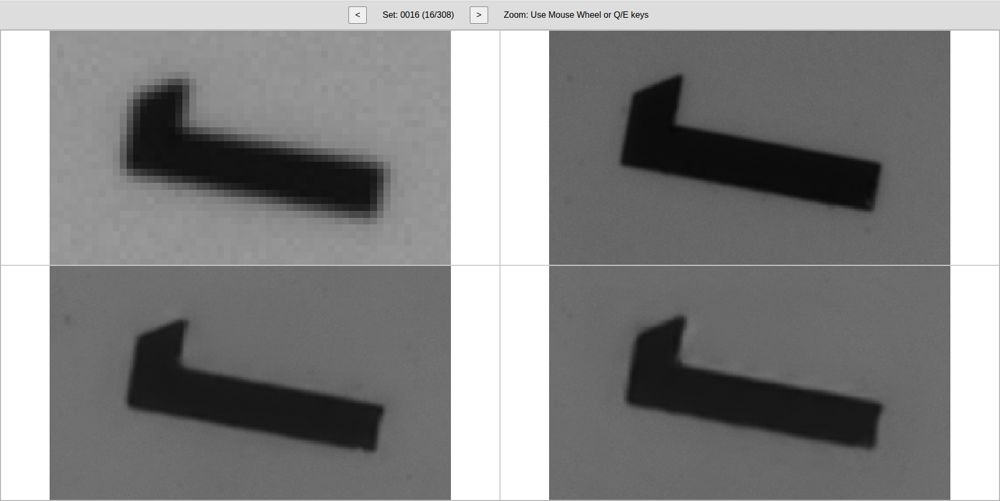

# Synced Quad-Image Viewer
A high-performance web application for viewing a 2x2 grid of images with synchronized panning and zooming. It's ideal for comparing different high-resolution images that share the same field of view, such as those from scientific instruments or multi-channel imaging.
### Features
- **Synchronized View:** Pan and zoom all four images simultaneously with a single action.
- **Progressive Image Loading:** Initially loads lightweight, low-resolution previews for a fast user experience, then seamlessly loads the full-resolution images in the background.
- **Image Set Navigation:** Easily cycle through multiple sets of quad-images.
- **Intuitive Controls:** Navigate using familiar mouse and keyboard shortcuts.
- **Pixel-Perfect Zoom:** Renders images with nearest-neighbor scaling (image-rendering: pixelated), preserving sharp details even at high zoom levels.
- **Pure JavaScript:** Built with vanilla JavaScript for performance, with no external frameworks.


```shell
# Install necessary libraries
pip install -r requirements.txt
```

```shell
# Start service with port 8000
bash run.sh
```

## Control
|Action|Control|
|---|---|
|Pan|Click and drag the mouse|
|Zoom|Scroll with the mouse wheel (zooms toward the cursor)|
|Center Zoom In|Press the **E** key|
|Center Zoom Out|Press the **Q** key|
|Next Image Set|Click the Next Set button or press the **D** key|
|Previous Image Set|Click the Prev Set button or press the **A** key|


## Example
Top-Left: Low resolution image from a 4x objective lens \
Top-Right: High resolution image from a 20x objective lens \
Bottom-Left: Upscaled image from model A (HAT) \
Bottom-Right: Upscaled image from model B (Richardson-Lucy + HAT) \


